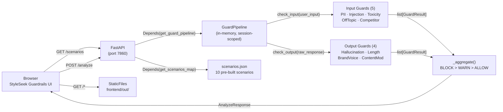

# Architecture: AI Guardrails Service

## System Diagram



## Startup Flow

```
uvicorn starts
  → lifespan() called
      → GuardPipeline() instantiated (9 guard objects created, ~1ms)
      → data/scenarios.json loaded → parsed to dict[scenario_id → scenario]
      → set_pipeline() + set_scenarios() called (module-level globals in deps.py)
  → serve requests (no warm-up delay — no model downloads)
```

## CAP Theorem Alignment

**Classification: AP (Availability + Partition Tolerance)**

The service is stateless — all state (pipeline, scenarios) is reconstructed from source code and a JSON file at startup in < 10ms. There is no database to lose consistency with. If the container restarts, it comes back identical. In the event of a guard exception, the pipeline catches it and returns `PASS` with a warning flag rather than failing the entire request.

## Concurrency Strategy

**Optimistic, fully stateless.** `GuardPipeline` is read-only after instantiation — all guard objects are pure functions over text. Python regex matching is thread-safe. `deps.py` globals are written once at startup (inside `lifespan()`) and read-only thereafter. No locking required.

## Idempotency

`POST /analyze` is idempotent: the same `scenario_id` + `user_input` always produces the same `AnalyzeResponse`. Guards are deterministic (regex and keyword matching). Clients may safely retry without side effects.

## Failure Modes

| Failure | Behavior | Recovery |
|---------|----------|----------|
| Guard raises an exception | Caught by pipeline; guard result set to PASS with warning detail | Investigate guard logic; check test coverage |
| `data/scenarios.json` missing at startup | Container exits with FileNotFoundError | Ensure file is included in Docker COPY step |
| Unknown `scenario_id` in /analyze | 422 Unprocessable Entity | Client uses /scenarios to get valid IDs |
| Rate limit exceeded | 429 Too Many Requests via slowapi | Caller backs off; no impact on other clients |
| Frontend/out missing at startup | StaticFiles not mounted; API still serves | Docker build must complete `next build` before Python stage |

## Performance Budget

| Component | Budget | Expected |
|-----------|--------|---------|
| Guard instantiation (startup) | < 10ms | ~1ms (9 small objects) |
| Input guards (5 regex checks) | < 5ms | ~1ms per guard |
| Output guards (4 regex checks) | < 5ms | ~1ms per guard |
| FastAPI routing overhead | < 10ms | ~5ms |
| **Total POST /analyze p99** | **< 50ms** | **~15ms** |

## Security

- Non-root `appuser` in Docker container
- CORS: `allow_origins=["*"]` (demo service — restrict in production)
- Rate limiting: 30 req/min per IP prevents abuse
- No PII logged: guard violations mask detected values before returning to client
- No API keys in container at runtime (no live LLM calls)
